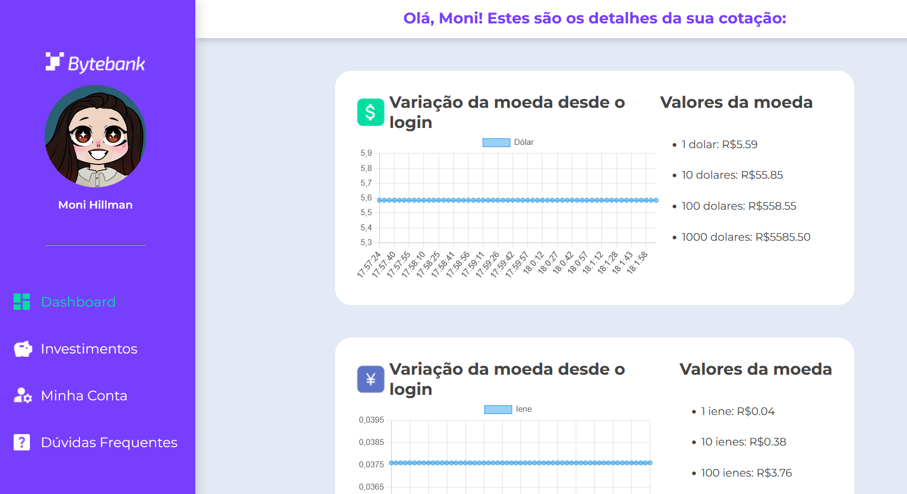
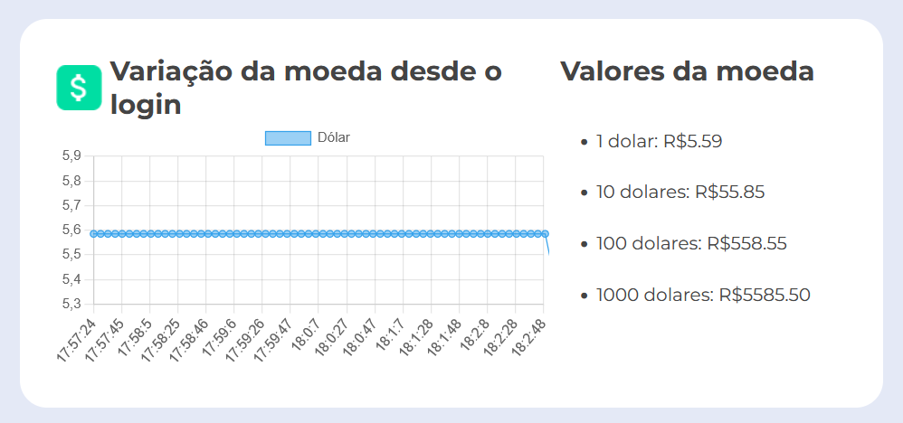
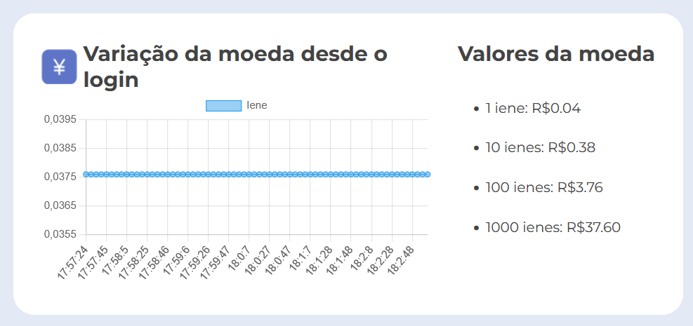
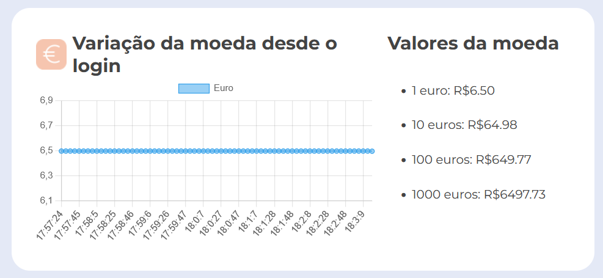

## 💱 ByteBank Cotações

O **ByteBank** é um painel de cotações de moedas com interface simples e moderna. O projeto apresenta um menu lateral, uma mensagem de boas-vindas no topo e gráficos com a **variação do dólar, euro e iene em relação ao real**, desde o momento do login. Utiliza **Web Workers** para requisições paralelas, garantindo uma **experiência fluida e responsiva**, mesmo com múltiplas tarefas em execução.

 

## 🚀 Sobre o Projeto

Este projeto foi desenvolvido durante o curso da Alura:

* "JavaScript: trabalhando com threads para requisições simultâneas"

O ByteBank aplica conceitos avançados como **concorrência e paralelismo**, implementando **Web Workers** para realizar requisições em paralelo sem travar a interface. Os dados recebidos são visualizados através de **gráficos interativos com Chart.js**.

## 📚 Objetivos do Curso

* Construir gráficos com a biblioteca **Chart.js**;
* Saber o que são **threads**;
* Desenvolver um projeto com **multithread**;
* Entender sobre **concorrência e paralelismo**;
* Realizar a construção de **Web Workers**;
* Compreender sobre **task queue, event loop e call stack**.

## 🛠️ Tecnologias Utilizadas

## 🖼️ Visualização do Projeto

Uma prévia das principais funcionalidades do **ByteBank Cotações**:

**🌐 Acesse o Projeto Online**

O projeto está disponível para visualização na **Vercel**. Clique no link abaixo para acessar:

**🏠 Página Inicial**

Tela principal do ByteBank com um menu lateral, uma mensagem de boas-vindas e gráficos mostrando a variação de moedas desde o login.

**💵 Cotação do Dólar**

Gráfico mostrando como o valor do dólar mudou desde o momento do login.

**💴 Cotação do Iene**

 Gráfico exibindo as mudanças no valor do iene desde o login no sistema.
 
 

**💶 Cotação do Euro**

Gráfico com a variação do euro em relação ao real desde o login do usuário.

